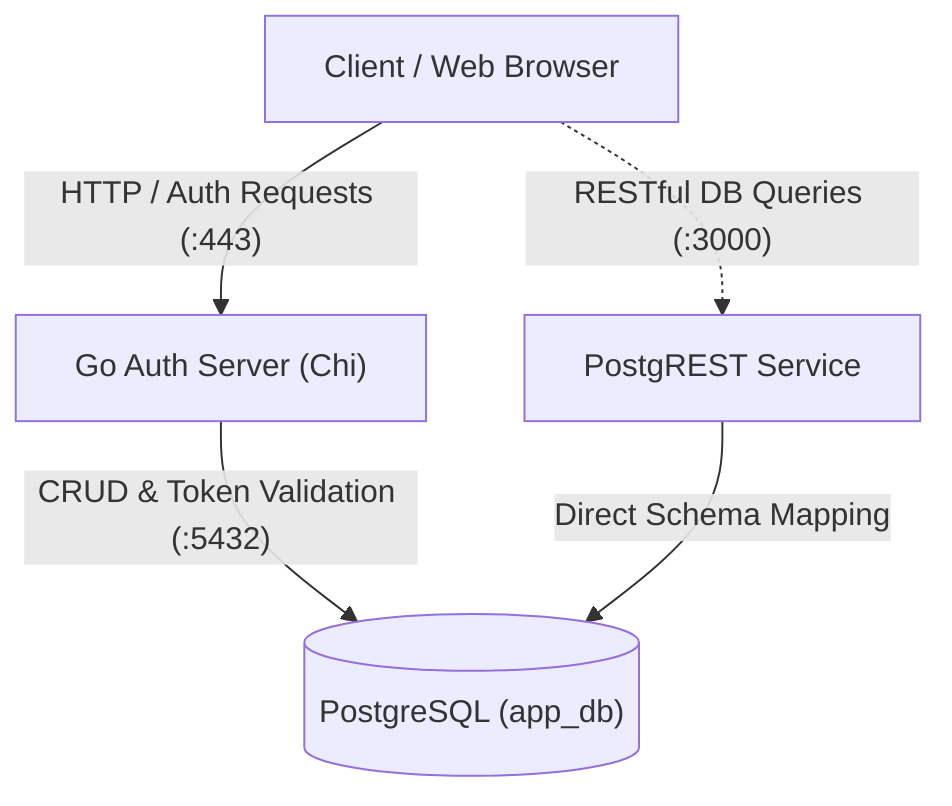

# Babys First PostgREST & Auth Server 🐣

A modular, lightweight authentication service and database scaffolding built with **Go (Chi)**, **PostgreSQL**, and **PostgREST**, running containerized with **Docker Compose**.

---

## 🏛️ Architecture Overview

The system pairs a custom Go-based authentication gateway with PostgREST sitting directly on top of PostgreSQL:

- **Go Auth Server (`:443`)**: Handles secure authentication operations (register, password hashing, JWT issue/refresh, verification codes, session invalidation).
- **PostgREST (`:3000`)**: Exposes RESTful endpoints directly from PostgreSQL tables and views using the `auth` schema for authorized queries.
- **PostgreSQL (`:5432`)**: Stores accounts, UUIDv7 primary keys, verification tokens, and refresh tokens.

---

## Meat and Potatoes

### 1. `auth-server/controllers/` (Highest Importance)
### 2. `auth-server/models/` (Core Business & Data Layer)
### 3. `init-db/` (Database Schema & Permissions)
### 4. `auth-server/` (Server Root & Router Configuration)
### 5. `auth-server/tests/` (Test Suites)
### 6. `auth-server/views/` (UI Templates)
### 7. `pgdata/` (Persistence Storage)

---

## 🚦 API Endpoints Reference

Base path: `/auth`

| Method | Endpoint | Access | Description | Cookies / Response |
| :--- | :--- | :--- | :--- | :--- |
| `POST` | `/auth/register` | Public | Registers a new user with UUIDv7 and creates email verification token | Sets `verification_token` cookie; outputs verification form |
| `POST` | `/auth/verify-email` | Public | Submits 6-digit code, verifies token match, marks user verified | Sets `access_token` (15m) & `refresh_token` (60d) cookies |
| `POST` | `/auth/login` | Public | Validates user credentials and issues fresh token pairs | Sets `access_token` and `refresh_token` cookies |
| `POST` | `/auth/refresh` | Public | Uses valid refresh token cookie to issue new access token | Refreshes `access_token` |
| `POST` | `/auth/logout` | Public/Private | Revokes active refresh token and clears session cookies | Clears cookies |
| `GET` | `/auth/me` | Protected | Returns profile data for currently authenticated user | Returns JSON user payload |

---

## 🔐 Token & Security Lifecycle

- **Email Verification Token**:
  - Valid for **15 minutes**.
  - Generated via HMAC-SHA256 JWT, stored alongside a 6-digit verification code.
- **Access Token**:
  - Valid for **15 minutes**.
  - Stored in an `HttpOnly`, `Secure`, `SameSite=Lax` cookie to mitigate XSS attacks.
- **Refresh Token**:
  - Valid for **60 days**.
  - Stored in an `HttpOnly` cookie and hashed/recorded in `auth.refresh_tokens` for revocation support.
- **Password Hashing**:
  - Passwords are encrypted using SHA-256 pre-hashing and `bcrypt` (`models/lib/lib.go`).

---

## Getting Running

### Prerequisites
Install and launch [`docker desktop`](https://www.docker.com/products/docker-desktop/)

Run `docker compose up`
Open `http://localhost:3000`

---

## 🧪 Test Data & Pre-seeded Accounts

The database comes pre-seeded from [`init.sql`](init-db/init.sql) with ready-to-test accounts:

| User | Email | Password | UUID |
| :--- | :--- | :--- | :--- |
| Alex Rivera | `alex.rivera@example.com` | `P@ssw0rd123` | `a0eebc99-9c0b-4ef8-bb6d-6bb9bd380a11` |
| Sarah Chen | `sarah.chen@techmail.org` | `SecureKey!99` | `b0eebc99-9c0b-4ef8-bb6d-6bb9bd380a12` |
| Jordan Smith | `jordan.smith@webmail.net` | `QueryMaster#1` | `c0eebc99-9c0b-4ef8-bb6d-6bb9bd380a13` |
| Marta Gomez | `marta.gomez@pro-dev.io` | `DevOps_Life2026` | `d0eebc99-9c0b-4ef8-bb6d-6bb9bd380a14` |

---

## 🗺️ Roadmap

### Phase 1: Core Auth Pipeline (In Progress)
- [x] PostgREST schema and Docker Compose setup.
- [x] Chi router initialization and base middleware stack.
- [x] Initial registration and verification controller logic.
- [ ] Connect `HashPassword` directly to `CreateUser` in registration flow.
- [ ] Complete `LoginController` password verification against stored bcrypt hashes.
- [ ] Finish token rotation logic in `RefreshTokenController`.
- [ ] Implement session invalidation and cookie clearing in `LogoutController`.
- [ ] Implement JWT authentication middleware for protected routes like `/auth/me`.

### Phase 2: Token Handling & Security
- [ ] Implement `DoTokensMatch` and full verification token code comparison in `models/lib/`.
- [ ] Implement `isValidRefreshToken` to check token expiration and database revocation status.
- [ ] Split `lib.go` into `jwthelpers.go` and generic cryptographic utilities.
- [ ] Implement CORS middleware policy for frontend origin requests.
- [ ] Add rate-limiting on sensitive endpoints (`/login`, `/register`, `/verify-email`).

### Phase 3: Testing & Tooling
- [ ] Add comprehensive end-to-end integration tests in `auth-server/tests/endpoints/`.
- [ ] Add Thunder Client / Postman collection exports for all endpoints.
- [ ] Expand test fixtures in `init-db/init.sql`.

### Phase 4: Frontend & User Experience
- [ ] Build dedicated frontend pages for Login, Registration, and Email Verification.
- [ ] Add dashboard / homepage with automatic redirection for unauthenticated sessions.
- [ ] Implement toast notifications / validation error states for user forms.
